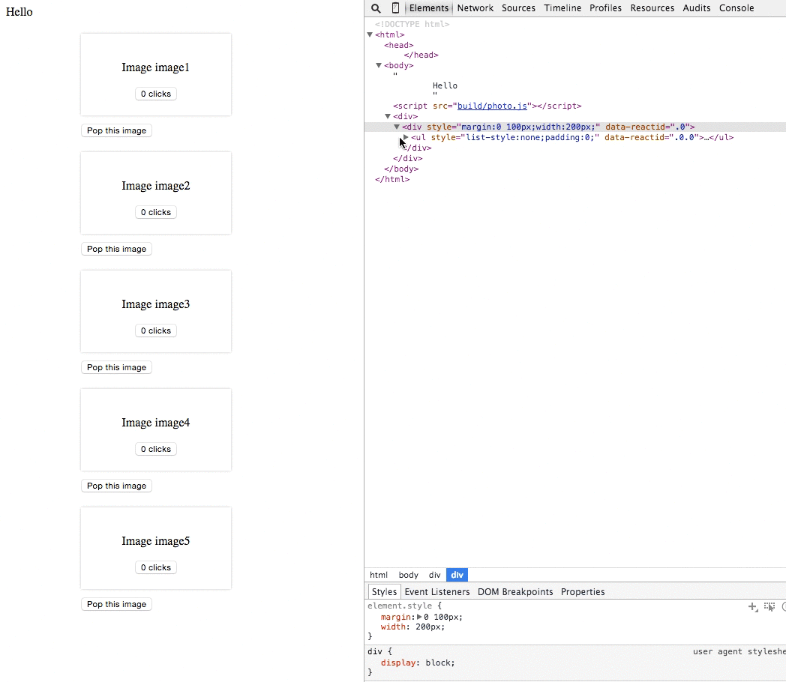

# teleporter

Teleport components around the tree without losing state or destroying the
DOM!

```javascript
import {teleportable, teleparent} from 'react-teleport'
```

## Examples

### [Basic Grid](docs/grid.mov)

[read the source](./example.js), interesing lines identified with `/***\ <---- \***/`

(click image for .mov)

[](docs/grid.mov)

### [Photo list](docs/photojump.mov)

[read the source](./photojump.js), interesing lines identified with `/***\ <---- \***/`

(click image for .mov)

[](docs/photojump.mov)

## API

### `@teleportable`

```javascript
/*
 * This function is best used as a decorator, and it makes a component "teleportable".
 *
 * A teleportable component can be moved between parents, nodes, etc. without
 * losing state, and without losing the DOM tree.
 *
 * Props:
 * - telekey: a teleport key. `teleparents` can create teleport keys.
 *
 * When the `teleparent` that created a telekey is garbage collected
 * (unmounted from the dom), then this teleportable component will also be
 * unmounted, but *not until then*.
 *
 * So if you have a long-lived teleparent with lots of teleportable children,
 * you could end up with a fair amount of garbage.
 */
```

### `@teleparent`

```javascript
/**
 * Also a @decorator. Makes a component into a `teleparent`.
 *
 * Teleparents can create telekeys (the unique ids used to manage teleportable
 * components), via two functions, given as props:
 *
 * - makeTelekey() -> a new telekey
 * - getTelekey(id) -> get (or create if needed) the telekey corresponding to
 *   some id
 *
 * If you only have one or two teleportable components, then `makeTelekey`
 * probably makes the most sense.
 *
 * If you have a bunch of components that need to be teleportable, that are
 * identified by some string id already, you can use `getTelekey(id)` to
 * always get the same `telekey` for a given `id`.
 *
 * See `photojump.js` for an example of using `getTelekey`, and `example.js`
 * for a simple example of using `makeTelekey`.
 */
 ```

